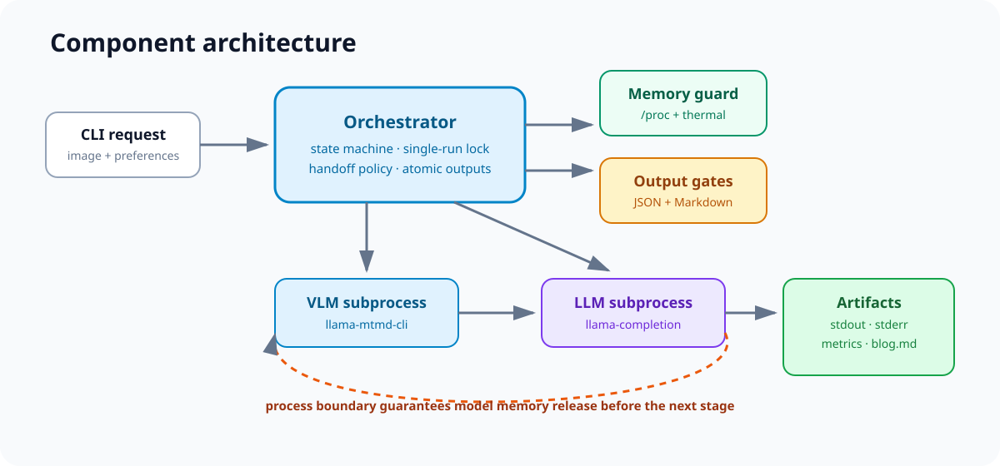
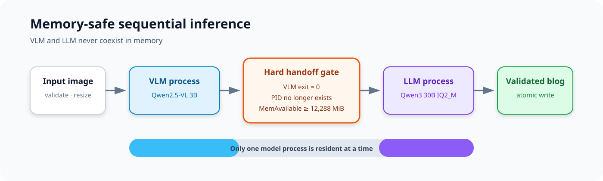
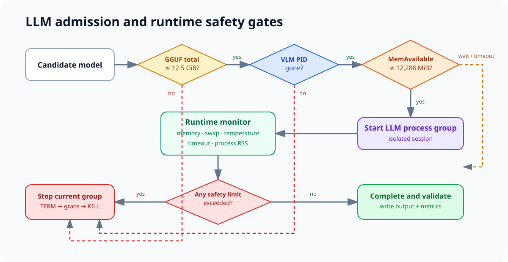

# Raspberry Pi 5 로컬 사진 블로그 에이전트 엔지니어링 문서

> **범위 안내.** 이 문서는 **사진 1장 → Markdown** 경로(`app/cli.py`, `app/orchestrator.py`)를 설명한다.
> 이후 추가된 **사진 여러 장 → `.txt` + GUI** 경로는 별도 문서에 있다: [`JOB_PIPELINE.md`](JOB_PIPELINE.md).
> 두 경로는 `memory_guard.py`, `process_runner.py`, `model_discovery.py`, `llama_options.py`를 공유한다.

## 1. 목적과 범위

이 시스템은 Raspberry Pi 5 16GB 한 대에서 사진을 로컬 VLM으로 구조화하고, VLM 메모리가 해제된 뒤 로컬 LLM으로 한국어 Markdown 블로그를 생성한다. 외부 추론 API를 사용하지 않으며 Python 프로세스는 모델을 직접 로드하지 않는다.

핵심 설계 목표는 품질보다 먼저 호스트 생존성을 보장하는 것이다. 16GB 장비에서 VLM과 30B MoE 계열 LLM의 가중치가 동시에 resident 상태가 되면 OOM 가능성이 크므로 두 모델은 subprocess로 순차 실행하고 process boundary에서 메모리를 반환한다.

## 2. 시스템 구성



| 구성 요소 | 책임 |
|---|---|
| `app/cli.py` | 요청 인자와 종료 코드 |
| `app/orchestrator.py` | 단방향 상태 머신과 단계 순서 강제 |
| `app/process_runner.py` | 새 process group 실행, 로그 streaming, timeout·안전 종료 |
| `app/memory_guard.py` | `MemAvailable`, swap, 온도, throttle 관찰 |
| `app/vision_runner.py` | `llama-mtmd-cli` VLM 명령 구성 |
| `app/llm_runner.py` | `llama-completion` LLM 명령 구성 |
| `app/output_parser.py` | VLM JSON과 최종 Markdown hard gate |
| `config/prompts.yaml` | prompt injection 방어와 출력 계약 |
| `scripts/retry_llm.py` | VLM 결과를 재사용하는 안전한 LLM 단독 재시도 |

## 3. 실행 워크플로우



1. `fcntl.flock`으로 단일 실행을 보장한다.
2. 이미지를 검증하고 최대 896px JPEG로 전처리한다.
3. `MemAvailable >= 4,096 MiB`를 확인한 뒤 VLM process group을 실행한다.
4. VLM 종료 코드와 PID 소멸을 확인하고 JSON schema를 검증한다.
5. `MemAvailable >= 12,288 MiB`가 회복될 때까지 기다린다.
6. 검증된 vision JSON을 데이터로만 취급해 블로그 prompt를 조립한다.
7. VLM PID가 없음을 다시 확인하고 LLM process group을 실행한다.
8. 실행 중 available memory, swap, 온도를 감시한다.
9. LLM 종료 후 필수 섹션, 최소 길이, prompt leakage를 검증하고 atomic write한다.

상태 전이는 `INITIALIZING → PRECHECK → PREPROCESSING_IMAGE → WAITING_FOR_VLM_MEMORY → RUNNING_VLM → STOPPING_VLM → WAITING_FOR_MEMORY_RELEASE → BUILDING_BLOG_PROMPT → WAITING_FOR_LLM_MEMORY → RUNNING_LLM → STOPPING_LLM → WRITING_OUTPUT → COMPLETED` 순서다. 정의되지 않은 전이는 즉시 실패한다.

## 4. OOM 방지 설계



### 모델 선택 gate

- LLM GGUF shard 전체 합계를 계산한다.
- `MAX_LLM_GGUF_GIB=12.5` 초과 모델은 명시적 override 없이는 거부한다.
- 16GB 검증 구성의 선택 모델은 10,845,131,168 bytes(약 10.10 GiB) `IQ2_M`이다.
- 17.28 GiB Q4 경로는 모델 파일 자체가 물리 RAM보다 커 page cache와 runtime buffer를 포함할 여유가 없어 폐기했다.

### 단계 사이 handoff gate

LLM 시작 조건은 논리 AND다.

```text
VLM exit code == 0
AND VLM PID does not exist
AND VLM JSON is valid
AND MemAvailable >= 12,288 MiB
AND agent lock is still held
```

`free`가 아닌 `/proc/meminfo`의 `MemAvailable`을 사용한다. page cache 회수 가능성까지 반영하면서도 LLM 실행 가능 메모리에 가까운 지표이기 때문이다. 기본적으로 `/proc/sys/vm/drop_caches`는 변경하지 않는다.

### 실행 중 safety gate

다음 중 하나가 참이면 현재 모델의 process group만 `SIGTERM`, grace timeout 후 `SIGKILL`한다.

- `MemAvailable < 1,536 MiB`
- swap 사용률 `> 85%`
- CPU 온도 `>= 82°C`
- 단계 timeout 초과

프로세스는 `start_new_session=True`로 분리한다. `pkill -f llama`, `killall`처럼 호스트의 다른 작업까지 죽일 수 있는 명령은 사용하지 않는다.

## 5. 출력 신뢰성 gate

VLM은 필수 key, 타입, 비어 있지 않은 summary·subjects를 가진 JSON 객체 하나만 허용한다. schema 예시 문자열을 그대로 복사하면 실패한다.

LLM Markdown은 다음을 모두 포함해야 한다.

- 지정된 본문 섹션 4개
- 이미지 대체 텍스트, 메타 설명, 추천 태그
- 최소 900자
- `<vision_data>`, `<think>`, 시스템 프롬프트 등 prompt/reasoning 누출 없음

구조 검증은 사실성 검증을 대체하지 않는다. 이번 smoke에서도 구조 gate를 통과한 모델 문장에서 사진으로 입증되지 않는 소재·디자인 단정을 사람이 제거했다. 운영 자동화 시에는 별도 grounding evaluator 또는 human approval 단계를 유지해야 한다.

## 6. 설치와 재현

```bash
git clone <repository-url>
cd rpi-photo-blog-agent
./scripts/bootstrap.sh
source .venv-blog-agent/bin/activate
./scripts/build_llama_cpp.sh
python scripts/download_models.py --dry-run
python scripts/download_models.py
cp .env.example .env
./scripts/doctor.sh
pytest -q
```

`llama.cpp`는 `.llama-cpp-version`의 commit을 재현 기준으로 사용한다. 빌드 결과와 upstream checkout은 저장소에 vendoring하지 않는다.

실행 예:

```bash
python -m app.cli \
  --image /path/to/photo.jpg \
  --topic "사진으로 살펴보는 주방 수납" \
  --audience "주방 정리를 고민하는 독자" \
  --tone "차분한 정보형" \
  --output outputs/blog.md
```

## 7. 관측성과 감사 자료

각 run은 request, 전처리 이미지, prompt, stdout/stderr, 파싱된 vision JSON, 최종 blog, metrics를 독립 디렉터리에 저장한다. metrics에는 모델 크기·양자화, 시작·종료 시각, duration, exit code, peak RSS, 단계 전후 available memory, 온도·throttle 상태가 포함된다.

공개 저장소는 개인정보와 대용량 로그를 피하기 위해 `runs/*`, `outputs/*`를 ignore한다. 검증 결과는 식별 경로를 제거한 `docs/evidence/`와 검수된 `examples/`에 명시적으로 복제한다.

## 8. 성능과 한계

- Raspberry Pi 5 CPU-only 30B MoE 생성은 느리다. 성공 retry LLM 단계는 약 11분 54초였다.
- IQ2 계열은 메모리 생존성을 얻는 대신 어휘·사실성 품질 손실 가능성이 있다.
- 입력 이미지에 대한 VLM 관찰 정확도와 LLM grounding은 자동 보장되지 않는다.
- throttle flag는 현재 상태뿐 아니라 과거 이벤트 bit도 포함할 수 있으므로 온도와 함께 판독한다.
- 검증 장비의 모델 저장소는 SD 카드였다. 반복 운영에는 NVMe를 권장한다.

## 9. 변경 시 회귀 기준

다음 변경은 full smoke가 필요하다.

- GGUF 모델 또는 양자화 변경
- llama.cpp commit 변경
- context, batch, ubatch, token limit 변경
- memory threshold 하향
- process lifecycle 또는 signal 처리 변경

full smoke 승인 조건은 VLM/LLM exit 0, VLM PID 선종료, memory handoff 성공, kernel OOM 없음, 구조 검증 통과, 사진 기반 콘텐츠 검수 통과다.

공개 회귀 입력은 `fixtures/smoke/kitchen-cabinets-sink.jpg`에 고정하고 SHA-256과 CC BY 2.0 attribution을 함께 검증한다. 이를 통해 입력 사진부터 최종 `examples/smoke-success.md`까지 동일한 평가 조건을 재현할 수 있다.
