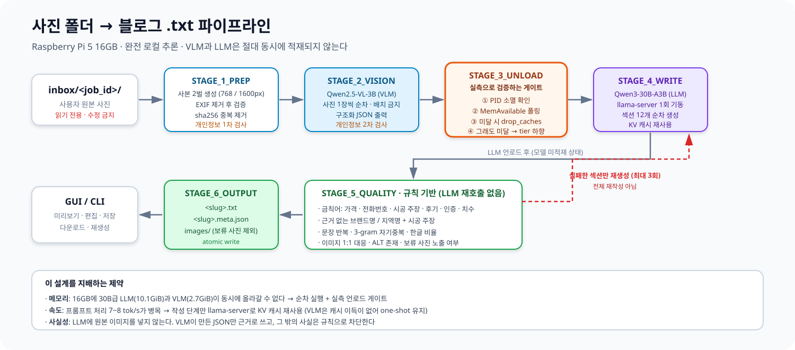
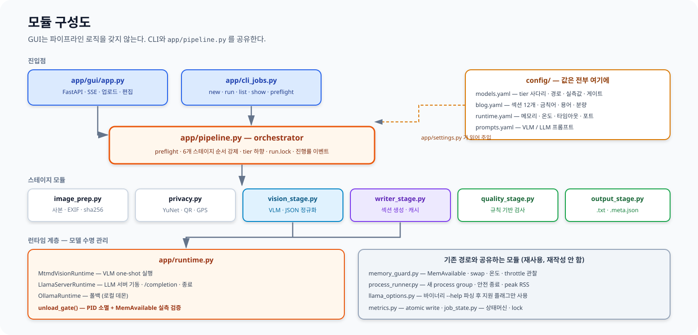
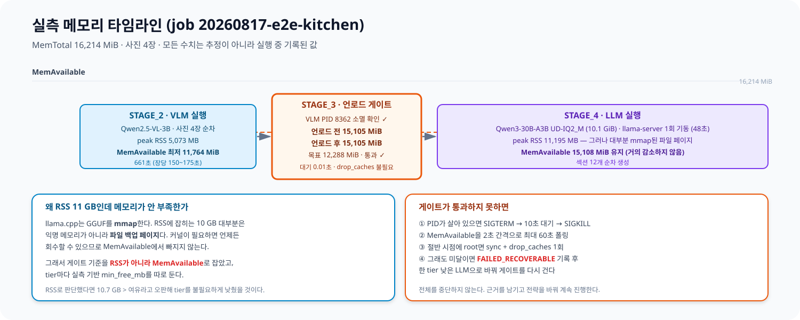
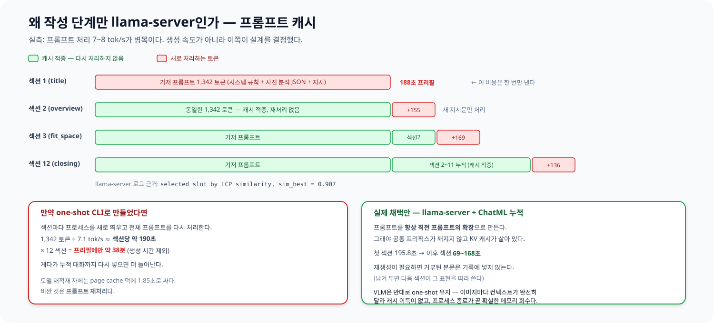
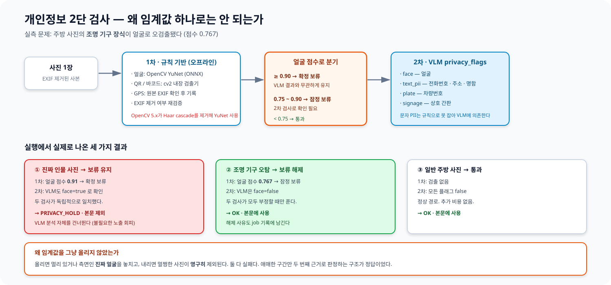
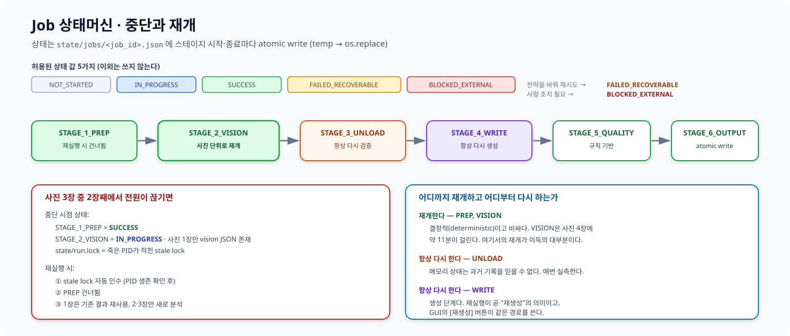

# 사진 폴더 → 블로그 `.txt` 파이프라인 — 엔지니어링 문서

Raspberry Pi 5 16GB 한 대에서 **인터넷 없이** 가구 사진 여러 장을 한 편의 한국어 블로그 글로 만드는 에이전트다.
클라우드 추론 API를 쓰지 않는다. 모든 추론은 이 장비의 `llama.cpp` 프로세스에서 일어난다.

| | 값 |
|---|---|
| 장비 | Raspberry Pi 5 Model B Rev 1.1 / 16 GB / aarch64 / kernel 6.18.34-rpt-rpi-2712 |
| 저장장치 | microSD 118.7 GiB (NVMe 없음), 여유 22 GiB |
| 스왑 | zram0 2 GiB (SD 카드 스왑 없음) |
| VLM | Qwen2.5-VL-3B-Instruct Q4_K_M + mmproj Q8_0 (2.7 GiB) |
| LLM | Qwen3-30B-A3B-Instruct-2507 UD-IQ2_M (10.1 GiB, MoE 총 30B / 활성 3B) |
| 런타임 | llama.cpp commit `0cea36222fe9bac5ebfc45716c9eef11f37046c4` |
| 산출물 | `output/<job_id>/<slug>.txt` + `<slug>.meta.json` + `images/` |

---

## 1. 전체 구조



### 1.1 기존 경로와의 관계

이 저장소에는 실행 경로가 두 개 있다. 기존 경로는 그대로 살아 있고 테스트도 계속 통과한다.

| | 사진 1장 → Markdown | **사진 여러 장 → `.txt` + GUI** |
|---|---|---|
| 진입점 | `app/cli.py` | `app/cli_jobs.py`, `app/gui/app.py` |
| orchestrator | `app/orchestrator.py` | `app/pipeline.py` |
| 출력 | `outputs/<run_id>.md` | `output/<job_id>/<slug>.txt` + `.meta.json` |
| LLM 실행 | `llama-completion` 1회 | `llama-server` 1회 기동 후 섹션 단위 다중 호출 |
| 상태 | `runs/<run_id>/metrics.json` | `state/jobs/<job_id>.json` (resume 가능) |
| 개인정보 | VLM `privacy_notes` | 규칙 기반 1차 + VLM 2차, `PRIVACY_HOLD` 분류 |

두 경로는 `memory_guard.py`, `process_runner.py`, `model_discovery.py`, `llama_options.py`, `metrics.py`를 공유한다.
**재작성하지 않고 재사용했다.**

### 1.2 모듈 구성



핵심 규칙 하나: **GUI는 파이프라인 로직을 갖지 않는다.** `app/pipeline.py`를 호출만 하며,
CLI(`python -m app.cli_jobs run --job <id>`)와 100% 동일하게 동작한다.

---

## 2. Phase 0 — 실측이 설계를 결정했다

수치는 전부 `bench/bench.py`로 측정했고 원본 기록은 `bench/raw/`에 있다.
이 환경에는 GNU `time -v`가 없어 psutil 기반 자체 샘플러로 대체했다.

### 2.1 합격 기준과 결과

| 기준 | 임계값 | 결과 |
|---|---|---|
| 모델 로드 성공, OOM 없음 | 필수 | PASS |
| 생성 속도 | ≥ 1.5 tok/s | PASS (벤치 4.79 / **실운영 2.38~3.83**) |
| swap 폭주 없음 | 지속 증가 없음 | PASS (swap 사용 0 MB) |
| VLM 이미지 1장 분석 | ≤ 180 s | PASS (159.8 s @ 768 px) |

### 2.2 지시서의 tier 사다리를 그대로 쓰지 않은 이유

원래 지시서는 dense 30B Q4_K_M(약 18 GiB)을 Tier A로 상정했다.
**16 GB 장비에 적재 불가라 사다리에서 제외**하고, 같은 30B급이되 MoE라 활성 파라미터가 3B인
`Qwen3-30B-A3B`를 IQ2_M(10.1 GiB)으로 쓴다. 이 경로는 이전 세션에서 Ollama Q4(17.28 GiB)가
OOM으로 죽은 뒤 확정된 것이며 이력은 [`RETRY_LOG.md`](../RETRY_LOG.md)에 있다.

VLM도 지시서는 7B를 상정했으나 장비에 3B만 있고, 3B가 게이트를 통과했으며 디스크 여유가 22 GiB뿐이라
받지 않았다. **근거 있는 하향은 실패가 아니다.** 수치는 [`bench/RESULTS.md`](../bench/RESULTS.md)에 있다.

---

## 3. 메모리 안전 — 이 설계의 1순위



### 3.1 mmap 때문에 RSS로 판단하면 안 된다

llama.cpp는 GGUF를 mmap한다. LLM 실행 중 `peak RSS 11,195 MB`가 잡히지만 그 대부분은
익명 메모리가 아니라 **파일 백업 페이지**다. 커널이 필요하면 회수할 수 있으므로 `MemAvailable`에서 빠지지 않는다.

실제로 LLM이 도는 동안 `MemAvailable`은 **15,108 MiB로 유지**됐다.
RSS 기준으로 판단했다면 "10.7 GB > 여유"라고 오판해 tier를 불필요하게 낮췄을 것이다.

→ **게이트 기준은 `MemAvailable`이고, tier마다 실측 기반 `min_free_mb`를 따로 둔다.**

### 3.2 언로드 게이트

"종료 명령을 보냈다"를 성공으로 치지 않는다. `app/runtime.py:unload_gate()`가 순서대로 확인한다.

1. PID 소멸 확인. 살아 있으면 SIGTERM → 10초 대기 → SIGKILL
2. `MemAvailable`을 2초 간격으로 최대 60초 폴링
3. 절반 시점에 목표 미달이고 root면 `sync` + `drop_caches` 1회
4. 그래도 미달이면 `FAILED_RECOVERABLE` 기록 후 **한 tier 낮은 LLM으로 바꿔 게이트를 다시 건다**

전체를 중단하지 않는다. 증거는 job json의 `memory_evidence.unload_gate`에 언로드 전/후 값으로 남는다.

실측 예시 (job `20260817-e2e-kitchen`):

```json
{"model": "VLM:qwen2.5-vl-3b-q4_k_m", "pid": 8362, "pid_gone": true,
 "available_before_mb": 15105, "available_after_mb": 15105,
 "target_mb": 12288, "waited_sec": 0.01, "cache_dropped": false, "passed": true}
```

---

## 4. 왜 작성 단계만 `llama-server`인가



실측에서 나온 결론이다. **병목은 생성 속도가 아니라 프롬프트 처리(7~8 tok/s)였다.**

- 기저 프롬프트가 1,342 토큰이다. one-shot으로 섹션 12개를 만들면 매번 이걸 다시 처리해야 한다.
  1,342 ÷ 7.1 ≈ 섹션당 190초 × 12 = **프리필에만 약 38분**.
- 모델 재적재 자체는 page cache 덕에 1.85초로 싸다. **비싼 것은 프롬프트 재처리다.**

그래서 `llama-server`를 한 번 띄우고, 프롬프트를 **항상 직전 프롬프트의 확장**이 되도록
ChatML 대화 기록으로 누적한다. `cache_prompt: true`와 맞물려 공통 프리픽스의 KV 캐시가 전부 재사용된다.

측정된 효과: 두 번째 섹션부터 새로 처리하는 토큰이 **134~169개뿐**이다.
llama-server 로그의 `selected slot by LCP similarity, sim_best = 0.907`이 이를 보여 준다.

**VLM은 반대로 one-shot을 유지한다.** 이미지마다 컨텍스트가 완전히 달라 캐시 이득이 없고,
프로세스 종료가 곧 확실한 메모리 회수이기 때문이다.

### 4.1 실운영 처리량 — 벤치 수치와 다르다

| 섹션 | 생성 토큰 | prompt eval | **생성 tok/s** | 소요 |
|---|---|---|---|---|
| title (기저 1,342토큰 프리필 포함) | 28 | 7.12 | **3.83** | 195.8 s |
| fit_space | 187 | 5.37 | **3.26** | 86.3 s |
| design_points | 195 | 5.01 | **3.03** | 98.2 s |
| material_hardware | 275 | 4.49 | **2.70** | 137.6 s |
| storage_design | 240 | 3.93 | **2.52** | 129.4 s |
| pros | 157 | 3.53 | **2.45** | 102.1 s |
| cons | 193 | 3.31 | **2.38** | 122.3 s |

**처리량이 컨텍스트 누적에 따라 단조 감소한다.** KV 캐시가 커지며 attention 비용이 늘기 때문이다.
게이트(1.5 tok/s)는 통과하지만 **마지막 섹션 기준 여유는 약 1.6배**이지 벤치가 시사하는 3.2배가 아니다.
섹션 수나 분량 상한을 올릴 때 반드시 감안해야 한다.

---

## 5. 사실성 — 사진에 없는 것을 쓰지 않게 만드는 장치

### 5.1 근거 격리

**LLM에는 원본 이미지를 넣지 않는다.** VLM이 만든 `vision/*.json` 통합본과 `config/blog.yaml`만 넣는다.
VLM은 이 시점에 이미 종료돼 있고, 멀티모달 컨텍스트를 다시 만들지 않는다.

### 5.2 VLM 출력 정규화

Qwen2.5-VL-3B는 지시 준수력이 약하다. 실측으로 확인된 실패 3가지와 대응:

| 관측된 실패 | 대응 |
|---|---|
| 한국어 지시에도 값이 영어로 나옴 (`"U-shaped"`, `"marble"`) | 필드별 **한국어 열거값**을 프롬프트에 명시 |
| 채워진 예시 JSON을 주니 그대로 베낌 (`"40자 이내 한국어 문장"`이 값으로 출력) | **완성 예시를 주지 않는다.** 키와 허용값만 나열 + 파서가 지시문 복사 검사 |
| 색상 단어를 하드웨어/수납 필드에 넣음 (`hardware_visible: ["화이트", ...]`) | `config/blog.yaml:vision_normalization.color_terms`로 색상만인 항목 제거 |

추가로 열거값 밖의 값은 `null`로 강등하고, `confidence < 0.5`면 분류 항목을 "확인되지 않음"으로 낮춘다.

### 5.3 품질 게이트

LLM 언로드 후 **규칙 기반으로만** 검사한다. 빠르고 결정적이다. 두 층으로 동작한다.

1. **섹션 검사** — 작성 중 호출. 실패하면 **그 섹션만** 최대 3회 재생성한다. 전체를 다시 쓰지 않는다.
   거부된 본문은 대화 기록에 넣지 않는다. 남겨 두면 다음 섹션이 그 표현을 따라 쓰기 때문이다.
2. **문서 검사** — 조립된 최종 문서를 검사한다.

검사 항목은 `config/blog.yaml:quality`에 있고 코드에는 없다.

| 검사 | 내용 |
|---|---|
| 금칙 정규식 | 가격, 전화번호, 시공 주장, 후기, 인증, 치수, placeholder, 프롬프트 누출 |
| 근거 없는 브랜드 | 본문에 등장하지만 vision JSON에 없는 브랜드명 |
| 지역명 + 시공 주장 | "분당 지역에서 시공한" 같은 조합 |
| 반복 | 동일 문장 3회 이상, 3-gram 자기중복률 |
| 언어 이탈 | 한글 비율 하한 |
| 이미지 | 참조와 실제 파일 1:1 대응, ALT 존재, 보류 사진 노출 여부 |

3회 재생성 후에도 통과하지 못하면 **조용히 통과시키지 않는다.**
`FAILED_RECOVERABLE`로 남기고 문제 구간을 GUI에 그대로 보여 준다.

---

## 6. 개인정보 보호



| 층 | 검출기 | 잡는 것 |
|---|---|---|
| 1차 (규칙 기반, 오프라인) | OpenCV YuNet(ONNX), `cv2.QRCodeDetector`, `cv2.barcode`, Pillow EXIF | 얼굴, QR, 바코드, 원본 GPS |
| 2차 (VLM) | `privacy_flags` | 문자 PII(전화번호·주소·명함), 차량번호, 상호 간판, 얼굴 |

**왜 임계값 하나로는 안 되는가.** 실측에서 주방 사진의 조명 기구 장식이 점수 0.767로 얼굴 오검출됐다.
임계값을 올리면 멀거나 측면인 진짜 얼굴을 놓치고, 내리면 멀쩡한 사진이 영구 제외된다. 둘 다 실패다.

그래서 2단으로 나눴다.

- 점수 **≥ 0.90** → 확정 보류. VLM 결과와 무관하게 유지하고, **VLM 분석 자체를 건너뛴다**
  (결과를 쓸 수 없고, 얼굴 사진을 모델에 통과시킬 이유도 없다).
- **0.75 ~ 0.90** → 잠정 보류. VLM 2차 검사가 얼굴을 부정하면 해제한다.

실행 결과: 진짜 인물 사진은 규칙 기반 0.91 + VLM 확인으로 보류 유지,
조명 기구 오탐은 0.767 + VLM 부정으로 해제됐다. 해제 사유도 job 기록에 남는다.

`PRIVACY_HOLD` 이미지는 본문에 실리지 않고 `output/<job_id>/images/`로 복사되지도 않는다.
품질 게이트가 최종 문서에서 보류 이미지 이름 등장 여부를 다시 검사한다.

> **한계.** 1차 검사는 얼굴·QR·바코드·GPS만 잡는다. 사진 속 전화번호나 주소 같은 문자 PII는
> OCR을 넣지 않았으므로 **VLM 2차 검사에만 의존한다.** 자세한 내용은 [`LIMITATIONS.md`](LIMITATIONS.md) 참조.

---

## 7. 상태 관리와 재개



- 스테이지 시작/종료마다 job json을 atomic write (temp → `os.replace`)
- 상태 값은 `SUCCESS | FAILED_RECOVERABLE | BLOCKED_EXTERNAL | IN_PROGRESS | NOT_STARTED` 다섯 가지만
- `state/run.lock`에 PID 기록. 그 PID가 살아 있으면 실행 거부, 죽어 있으면 stale lock으로 보고 인수
- 같은 이미지 집합(sha256 정렬 해시)으로 완료된 job이 있으면 CLI가 재생성 대신 확인을 요구 (`--force`로 진행)

**어디까지 재개하는가:**

| 스테이지 | 재개 | 이유 |
|---|---|---|
| PREP | 건너뜀 | 결정적이고 이미 결과가 있다 |
| VISION | **사진 단위로 재개** | 가장 긴 스테이지(사진 4장 = 11분). 재개 이득의 대부분 |
| UNLOAD | 항상 다시 | 메모리 상태는 과거 기록을 믿을 수 없다 |
| WRITE | 항상 다시 | 생성 단계. 재실행이 곧 "재생성"이고 GUI 버튼이 같은 경로를 쓴다 |

---

## 8. 실패 처리 정책

| 상황 | 처리 |
|---|---|
| 모델 로드 OOM | 한 tier 낮은 quant/모델로 자동 폴백, 기록 후 계속 |
| VLM 이미지 1장 실패 | 해상도 낮춰 1회 재시도 → 그래도 실패면 그 사진만 건너뛰고 나머지 진행 |
| VLM JSON 스키마 위반 | 파서가 거부 → 재시도 → 실패 시 스킵 (지어낸 값으로 채우지 않는다) |
| 언로드 후 RAM 부족 | drop_caches → 대기 → tier 하향 |
| 섹션 품질 실패 | 해당 섹션만 최대 3회 재생성 → 실패 시 `FAILED_RECOVERABLE`로 노출 |
| 작성 총 예산 초과 | 남은 섹션 중단, 만든 것은 보존, `FAILED_RECOVERABLE` |
| 디스크 부족 | `BLOCKED_EXTERNAL`. 정리 대상을 안내하되 **자동 삭제하지 않는다** |
| 모델 파일 없음 | `BLOCKED_EXTERNAL`. 정확한 다운로드 명령을 메시지에 포함 |
| 온도 초과 | 지정 시간 대기 후 계속. 중단하지 않고 기록 |

모든 재시도는 job json의 `retries` 배열과 [`RETRY_LOG.md`](../RETRY_LOG.md)에 남는다.

---

## 9. 설정 — 코드에 값이 없다

| 파일 | 내용 |
|---|---|
| `config/models.yaml` | VLM/LLM tier 사다리, 모델 경로, ctx, 샘플링, **실측값**, Phase 0 게이트 |
| `config/blog.yaml` | 문체, 12개 섹션 구조, 카테고리, 금칙어 정규식, 브랜드 후보, 용어사전, 분량, 색상어 |
| `config/runtime.yaml` | 경로, 메모리 임계값, 온도 정책, 타임아웃, 이미지 크기, 개인정보 임계값, GUI 포트 |
| `config/prompts.yaml` | VLM/LLM 프롬프트 (`furniture_*` 키가 이 경로용) |

코드에는 스키마와 안전한 기본값만 있다. 새 값을 하드코딩하지 말고 YAML에 추가한다.

---

## 10. 산출물 형식

```
================================================
TITLE: 청록색 상부장과 화이트 원목 무늬 도어가 어우러진 일자형 주방
DATE: 2026-08-17 16:21 KST
CATEGORY: 부엌가구
TAGS: 주방가구, 싱크대, 오크
SUMMARY: (1~2문장)
IMAGES:
  - kitchen-cabinet-01.webp | 참고 이미지 | ALT: 청록색 원목무늬 일자형 주방 상부장
  - kitchen-cabinet-02.webp | 참고 이미지 | ALT: 갈색 원목무늬 일자형 주방 상부장
NOTE: 개인정보 보류로 본문에서 제외된 사진 1장이 있습니다.
SOURCE: 사용자 제공 사진 (VLM 분석 기반) / 외부 인용 없음
================================================

[한눈에 보기]
...
```

`.meta.json` 사이드카에 title, slug, tags, images(sha256 포함), 모델 정보, job_id,
생성 시각, 토큰 수, 섹션별 소요 시간, 품질 검사 결과가 들어간다.

---

## 11. 사용법

```bash
cd ~/rpi-photo-blog-agent
source .venv-blog-agent/bin/activate

./scripts/preflight.sh          # 모델·RAM·디스크·스왑·온도 점검
./scripts/doctor.sh             # 더 상세한 환경 점검
pytest -q                       # 회귀 테스트

# CLI
./scripts/run_cli.sh new --images ~/photos/kitchen --category 부엌가구 --topic "좁은 주방 수납"
./scripts/run_cli.sh run --job <job_id>
./scripts/run_cli.sh list
./scripts/run_cli.sh show --job <job_id>

# GUI (같은 orchestrator를 호출한다)
./scripts/run_gui.sh            # http://<pi-ip>:8770

# 검증
./scripts/resume_test.sh <job_id>    # 강제 종료 후 재개 확인
./scripts/offline_test.sh <job_id>   # 네트워크 네임스페이스 분리 후 실행
```

사진 4장 기준 1회 완주에 약 30분이 걸린다. 실행 중 다른 모델 서버를 동시에 띄우지 않는다.

---

## 12. 로컬 추론임을 확인하는 방법

의심스러우면 직접 확인할 수 있다. 실행 중에:

```bash
# 1. 추론 프로세스와 로드한 모델 파일
ps -eo pid,rss,args | grep llama-server

# 2. 이 프로세스의 네트워크 연결 전체 — 루프백 외에는 없어야 한다
ss -tanp | grep "pid=<PID>"

# 3. GGUF가 실제로 프로세스에 매핑됐는지
grep gguf /proc/<PID>/maps

# 4. 코드에 외부 추론 API가 없는지
grep -rniE "api\.openai|anthropic|googleapis|Authorization: Bearer" app/
```

실제 확인 결과: `llama-server`는 `127.0.0.1:8771`에만 바인딩되고 외부 연결이 0개이며,
10.1 GiB GGUF가 프로세스 주소공간에 mmap돼 있다. 코드가 접속하는 주소는
`127.0.0.1:8771`(llama-server)과 `127.0.0.1:11434`(로컬 ollama 폴백)뿐이다.

---

## 13. 한계점 · 개선점 · 문제점

별도 문서로 정리했다 → [`LIMITATIONS.md`](LIMITATIONS.md)

## 14. 관련 문서

- [`../AGENTS.md`](../AGENTS.md) — 이 저장소의 불변 원칙과 금지 사항
- [`../bench/RESULTS.md`](../bench/RESULTS.md) — Phase 0 실측 수치 전체
- [`../RETRY_LOG.md`](../RETRY_LOG.md) — 전략을 바꾼 지점과 이유
- [`../WORK_LOG.md`](../WORK_LOG.md) — 시간순 작업 기록
- [`../TASK_STATUS.md`](../TASK_STATUS.md) — 완료 정의 체크리스트
- [`SOURCE_MAP.md`](SOURCE_MAP.md) — 소스 파일별 책임
- [`ENGINEERING.md`](ENGINEERING.md) — 기존 단일 이미지 경로 문서
