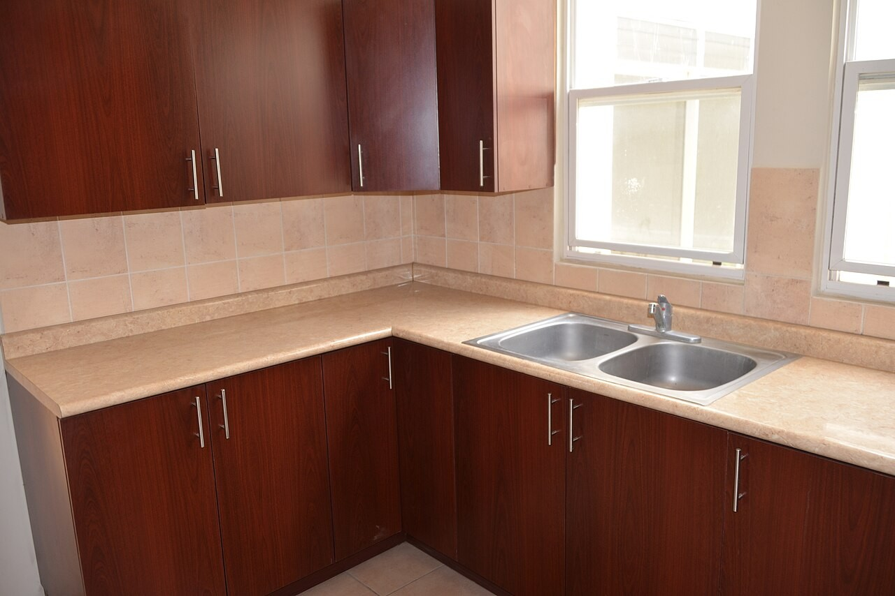

# Smoke test 및 OOM incident 분석

## 결론

실패 원인은 단순히 VLM과 LLM의 동시 resident 상태만이 아니었다. VLM을 먼저 정상 unload해 13,940 MiB available memory를 확보해도 17.28 GiB Q4 LLM은 Raspberry Pi 5 16GB에서 runtime buffer와 함께 수용되지 않아 kernel OOM으로 종료됐다. 해결은 순차 handoff를 유지하면서 LLM을 10.10 GiB IQ2_M으로 낮추는 것이었다.

## 시도 비교

| 단계 | 런타임·모델 | 결과 | 판단 |
|---|---|---|---|
| 실패 기준선 | Ollama `qwen3:30b-a3b`, Q4, 17.28 GiB | HTTP 500, kernel이 `llama-server` OOM kill | 순차 실행만으로 부족, 모델 자체가 과대 |
| 전환 1 | llama.cpp `llama-cli` | sandbox에서 free local port 확보 실패 | server/interactive 성격 없는 completion binary 필요 |
| 전환 2 | llama.cpp `llama-completion`, IQ2_M 10.10 GiB | VLM 0, LLM 0, OOM 없음 | 기술 파이프라인 성공 |
| 콘텐츠 승인 | 성공 retry 원문 + 사진 대조 | 근거 없는 표현 제거, 구조·해시 검증 | 최종 샘플 승인 |

## 실패 기준선 분석

2026-08-16 `matrix-20260816T152258Z`에서 다음은 정상 동작했다.

- VLM `keep_alive=0` 요청
- Ollama unload API 호출
- `/api/ps`에서 loaded model 없음 확인
- LLM 직전 available memory 13,940 MiB 확인

그럼에도 Q4 모델 파일 17.28 GiB와 CPU repack/runtime 메모리가 물리 RAM을 넘었고 kernel OOM killer가 `llama-server`를 종료했다. 즉 원인 트리는 다음과 같다.

```text
HTTP 500
└─ llama-server 비정상 종료
   └─ kernel OOM kill
      ├─ 17.28 GiB 전체 가중치
      ├─ CPU repack/runtime buffer
      └─ 16GB 물리 RAM 한계
```

호스트 재부팅은 이 smoke 실행에서는 발생하지 않았지만, 최초 관찰된 OOM 재부팅과 같은 위험군이므로 해당 모델 구성은 운영 금지로 결정했다.

## 성공 실행 증거

Run ID: `20260816T160703Z-f3393417`



입력은 Wikimedia Commons의 “Kitchen Cabinets - Sink” by amslerPIX, CC BY 2.0 사진을 1280×854 RGB JPEG로 정규화하고 EXIF를 제거한 파일이다. 입력 SHA-256은 `1c007ab919b41d30f49729346ab5eef1734748f787249e419c60794c04c69649`이며, [`fixtures/smoke/ATTRIBUTION.md`](../fixtures/smoke/ATTRIBUTION.md)에 출처와 파생 작업을 기록했다.

| 지표 | VLM | LLM retry |
|---|---:|---:|
| 모델 크기 | 1,929,901,056 bytes | 10,845,131,168 bytes |
| exit code | 0 | 0 |
| duration | 403.172 s | 714.294 s |
| peak RSS | 5,046.4 MiB | 10,668.9 MiB |
| 시작 전 MemAvailable | 14,651 MiB | 15,130 MiB |
| 종료 후 MemAvailable | 15,145 MiB | 15,233 MiB |

VLM 종료 뒤 memory recovery target 12,288 MiB를 0.006초 만에 충족했다. 성공 retry 구간에서 kernel OOM 기록은 없었다. 최종 출력의 모든 필수 섹션과 metadata가 존재하고 prompt leakage가 없음을 확인했다.

원본 full run은 첫 LLM 생성도 exit 0이었으나 당시 출력이 잘리고 prompt prefix가 섞이는 문제가 있었다. `llama-completion`의 `--no-conversation`, `--simple-io`, `--no-display-prompt` 지원 여부를 감지해 적용한 뒤 1,200 token retry로 최종 원문을 생성했다.

## 콘텐츠 검수

모델 원문은 구조 gate를 통과했지만 이미지에서 확정할 수 없는 소재·디자인 표현이 있었다. 원문은 로컬 run의 `llm_retry_stdout.txt`에 보존하고, 최종 샘플에서는 해당 표현을 제거했다.

- 최종 파일: `examples/smoke-success.md`
- 문자 수: 1,418자(한국어 본문 기준 기록)
- SHA-256: `69b0e33d3b31993d370064acb75059398d4080440363df400276de2a46de4a67`
- 필수 섹션: 통과
- prompt/reasoning leakage: 없음
- 사진 대조: 완료

## 재발 방지 기준

1. VLM과 LLM을 daemon에 동시에 유지하지 않는다.
2. VLM PID가 남아 있으면 LLM 시작을 거부한다.
3. LLM 전 `MemAvailable` 12,288 MiB를 하향하지 않는다.
4. 12.5 GiB 초과 GGUF는 override 없이 거부한다.
5. Q4 17.28 GiB 구성은 Raspberry Pi 5 16GB 운영 대상에서 제외한다.
6. 실행 중 1,536 MiB available memory safety floor를 유지한다.
7. 모델·llama.cpp·context 변경 시 kernel journal을 포함한 full smoke를 다시 수행한다.
